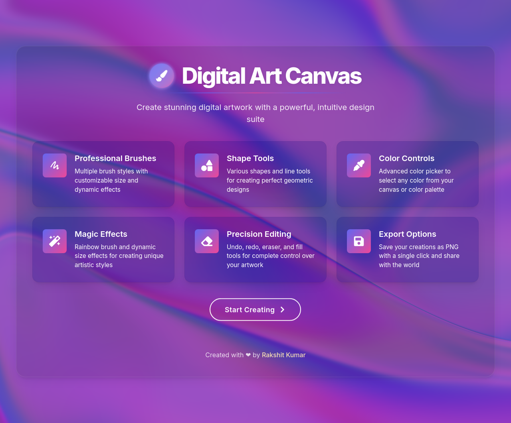

# Digital Art Canvas

A powerful interactive digital art canvas application built with React. This application provides a rich set of drawing tools and effects to create beautiful digital artwork.



## Features

- **Professional Drawing Tools**: Brush, Eraser, Line, Rectangle, Circle, Text, Eyedropper, Fill
- **Advanced Brush Settings**: Customizable size, opacity, and color
- **Magic Effects**: Rainbow brush with dynamic colors and size-shifting brush
- **Text Tool**: Add text with various fonts and sizes
- **Canvas Actions**: Undo/Redo, Clear canvas, Save image
- **Keyboard Shortcuts**: Quickly access tools and functions
- **Responsive Design**: Works on desktop and mobile devices

## Getting Started

### Prerequisites

- Node.js (v14 or later)
- npm or yarn

### Installation

1. Clone the repository:
```bash
git clone https://github.com/yourusername/digital-art-canvas.git
cd digital-art-canvas
```

2. Install dependencies:
```bash
npm install
# or
yarn install
```

3. Start the development server:
```bash
npm start
# or
yarn start
```

4. Open your browser and navigate to `http://localhost:3000`

## Keyboard Shortcuts

| Key       | Function             |
|-----------|----------------------|
| B         | Brush Tool           |
| E         | Eraser Tool          |
| L         | Line Tool            |
| R         | Rectangle Tool       |
| C         | Circle Tool          |
| T         | Text Tool            |
| I         | Eyedropper Tool      |
| F         | Fill Tool            |
| M         | Toggle Rainbow Brush |
| W         | Toggle Dynamic Width |
| Ctrl+Z    | Undo                 |
| Ctrl+Y    | Redo                 |
| Ctrl+S    | Save Image           |
| Esc       | Clear Canvas         |

## Tools Overview

### Basic Tools
- **Brush**: Standard drawing tool with customizable size and opacity
- **Eraser**: Remove parts of your drawing
- **Line**: Draw straight lines
- **Rectangle**: Create rectangular shapes
- **Circle**: Create circular shapes
- **Text**: Add text to your canvas
- **Eyedropper**: Pick colors from the canvas
- **Fill**: Fill areas with selected color

### Magic Effects
- **Rainbow Brush**: Creates a gradient effect as you draw
- **Dynamic Width**: Automatically varies the brush size as you draw

### Canvas Actions
- **Undo/Redo**: Navigate through your drawing history
- **Clear Canvas**: Start fresh with a blank canvas
- **Save Image**: Download your artwork as a PNG file
- **Fill Background**: Change the background color of your canvas

## Building for Production

To build the application for production, run:

```bash
npm run build
# or
yarn build
```

This will create an optimized production build in the `build` folder.

## Technologies Used

- React
- HTML5 Canvas API
- CSS3
- React Icons

## License

This project is licensed under the MIT License - see the LICENSE file for details.

## Acknowledgments

- Inspired by various digital painting applications
- Thanks to all the open-source libraries that made this project possible

## Contributing

1. Fork the project
2. Create your feature branch (`git checkout -b feature/amazing-feature`)
3. Commit your changes (`git commit -m 'Add some amazing feature'`)
4. Push to the branch (`git push origin feature/amazing-feature`)
5. Open a Pull Request
